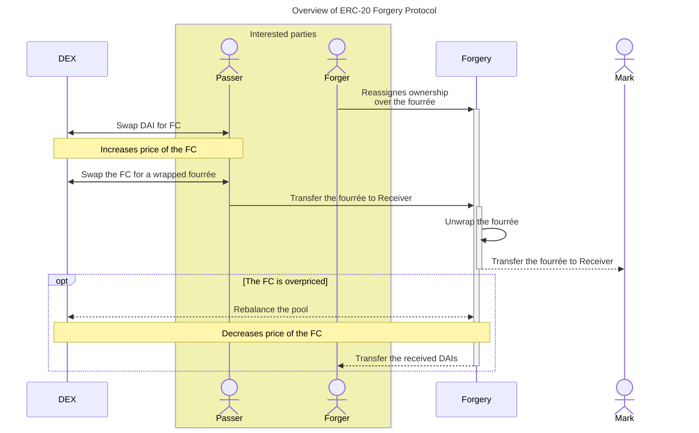
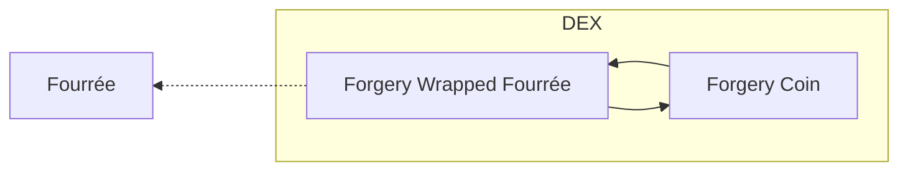

# ERC-20 Forgery Protocol

Zero-knowldge app for forgers and passers based on Railgun

sd

## Overview

* Forger reassigness the owneship of its fourrée over to Forgery
  and receives regular rewards based on its usage.
* Flasher

### Tokenomics

#### Fourrée

Fr is an ownable token that mimics another popular one --- the referent.
The best Fr is the closest to its referent overview at [Blockscan](https://blockscan.com).

> Do not confuse with ["Flash"](https://bitcointalk.org/index.php?topic=5339511.0) which is actually an attempt to scam scammers. The idea of fake transactions that live for up to a half of a year is impossible.

#### Forgery Wrapped Fourrée

FWCs are deployed along with fourrée ownership reassignment over to the Forgery.

Passers use `withdrawTo(address account, uint256 value)` as in [`ERC20Wrapper.sol`](https://github.com/OpenZeppelin/openzeppelin-contracts/blob/master/contracts/token/ERC20/extensions/ERC20Wrapper.sol) to unleash the token onto the mark.

#### Forgery Coin

Passers buy the FCs to pay for prefixed with "fw" versions of the tokens owned by the Forgery on a DEX and unwrap them afterwards.

FCs can be bought on the same DEX for [DAI](https://etherscan.io/token/0x6b175474e89094c44da98b954eedeac495271d0f)
or earned when a fourrée is bought and unwrapped by the forger.

### Fourrée Owneship

### Security Issues

#### Anonymity of Forgers and Passers

#### Marking of Fourrée as "Scam"

### Revenue model

The protocol does't have any own fees and treasures.
The mission is to create a protocol for forgers and passers, not a business.

Contracts development is paid by using its frontend, where is a built-in host tipping.

[^1]: https://eips.ethereum.org/EIPS/eip-173
